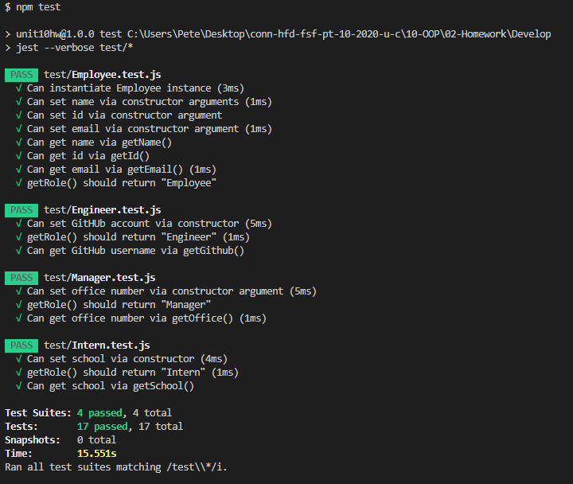

  # Employee-Template-Generator :metal:

   
   
  This application is covered by the Mozilla license.
  
   ## Table of Contents
  - [Description](#Description)
  - [Installation](#Installation)
  - [Usage](#Usage)
  - [Lincense](#Lincense)
  - [Contributing](#Contributing)
  - [Tests](#Tests)
  - [Questions](#Questions)

  ## Description  :clipboard:
  This is a application designed to quickly create an html page for the employees of a software development team. 
   
  Created with JS and love :heart:.

  ## Installation :floppy_disk:
  To install this application you should: 
  1. `git clone https://github.com/peter-izzo/Employee-Template-Generator` 
  2. `cd Develop` 
  3. `npm install`
  
  ## Demo Video
  
  
  ## Usage :warning:
  This application will prompt the user for information about all the members of their dev team. When all employees' information is given, the application then renders an HTML page with each member of the roster in a card for easy access and viewing of each member's information.
  
  ## License :scroll:
  
   
  This application is uses the Mozilla license. 

  ## Contributors :family:
  Peter Izzo
  
  Feel free to submit a pull request with any updates you would like to submit :)

  ## Tests 🧪
  
  ### Screenshot of Successful Tests

  

  ## Questions :question:
  ### For any issues please reach out to Peter Izzo
   
  Feel free to reach out to me at  with any questions :wave: 
   
  Check out the rest of my Github: https://github.com/peter-izzo :octocat: 
   

  _This README was generated by [README-GEN](https://github.com/peter-izzo/README-GEN) :godmode:_

